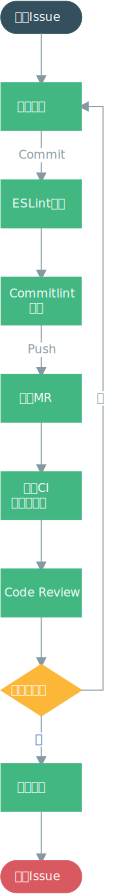

# 构建流程

## 手脚架

手脚架使用 [@vue/cli 4.x](https://cli.vuejs.org/)，启用自定义配置，配置流程如下：

```bash
# 选择项目所需要的特性：
# Babel（启用Babel转码）
# PWA （启用PWA）
# Router （安装vue-router）
# Vuex （安装vuex）
# CSS Pre-processors （使用CSS预处理器）
# Linter / Formatter （使用静态检查/格式化）
# Unit Testing （启用单元测试）
# E2E Testing（启用E2E测试）
Check the features needed for your project:
 (*) Babel
 ( ) TypeScript
 (*) Progressive Web App (PWA) Support
 (*) Router
 (*) Vuex
 (*) CSS Pre-processors
 (*) Linter / Formatter
 (*) Unit Testing
 (*) E2E Testing
```

::: tip
除TypeScript必选
:::

```bash
# 路由使用 history mode? (需要配置正式服务器) Y
Use history mode for router? (Requires proper server setup for index fallback in production) (Y/n) Y
```

::: tip
关于history mode的配置可以查看[这里](https://router.vuejs.org/guide/essentials/history-mode.html)
:::

```bash
# 选择CSS预处理器（PostCSS, Autoprefixer 和 CSS Modules 默认支持）：Sass/SCSS (with dart-sass)
Pick a CSS pre-processor (PostCSS, Autoprefixer and CSS Modules are supported by default):
> Sass/SCSS (with dart-sass)
  Sass/SCSS (with node-sass)
  Less
  Stylus
```

::: tip
其他预处理器如果需要可以独立安装
:::

```bash
# 选择linter / formatter配置：ESLint + Airbnb config
Pick a linter / formatter config:
  ESLint with error prevention only
> ESLint + Airbnb config
  ESLint + Standard config
  ESLint + Prettier
```

```bash
# 选择其他lint功能：Lint on save, Lint and fix on commit
Pick additional lint features:
 (*) Lint on save
 (*) Lint and fix on commit
```

```bash
# 选择单元测试方案：Mocha + Chai
Pick a unit testing solution:
> Mocha + Chai
  Jest
```

```bash
# 选择E2E测试方案：Nightwatch
Pick a E2E testing solution:
  Cypress (Chrome only)
> Nightwatch (WebDriver-based) 
```

```bash
# 选择浏览器以运行端到端测试：Chrome, Firefox
Pick browsers to run end-to-end test on
 (*) Chrome
 (*) Firefox
```

```bash
# 在哪里放置Babel，PostCSS，ESLint等的配置：In dedicated config files（在专用配置文件中）
Where do you prefer placing config for Babel, PostCSS, ESLint, etc.?
> In dedicated config files
  In package.json 
```

## 构建命令

我们需要在`package.json`文件配置以下命令：

```json{3}
{
  "scripts": {
    "build": "vue-cli-service build --modern"
  }
}
```

并通过此命令构建应用程序：

```bash
yarn build
```

::: tip
包管理工具统一使用 [yarn](https://yarnpkg.com/zh-Hans/)，因为其速度更快。
:::

通过构建，我们会得到：

* `index.html` 会带有注入的资源和 resource hint
* 第三方库会被分到一个独立包以便更好的缓存
* 小于 10kb 的静态资源会被内联在 JavaScript 中
* `public` 中的静态资源会被复制到输出目录中

我们使用了`--modern`参数 使用现代模式构建应用，为现代浏览器交付原生支持的 ES2015 代码，并生成一个兼容老浏览器的包用来自动回退。
* 现代版的包会通过 `<script type="module">` 在被支持的浏览器中加载；它们还会使用 `<link rel="modulepreload">` 进行预加载。
* 旧版的包会通过 `<script nomodule>` 加载，并会被支持 ES modules 的浏览器忽略。
* 一个针对 Safari 10 中 `<script nomodule>` 的修复会被自动注入。
* 经过分析，现代版的包已经小了约 16%。在生产环境下，现代版的包通常都会表现出显著的解析速度和运算速度，从而改善应用的加载性能。

::: tip
`<script type="module">`需要配合始终开启的 CORS 进行加载。这意味着你的服务器必须返回诸如 `Access-Control-Allow-Origin: * `的有效的 CORS 头。如果你想要通过认证来获取脚本，可使用 `corsUseCredentials` 选项。

同时，现代浏览器使用一段内联脚本来避免 Safari 10 重复加载脚本包，所以如果你在使用一套严格的 `CSP`，你需要这样显性地允许内联脚本：

```
Content-Security-Policy: script-src 'self' 'sha256-4RS22DYeB7U14dra4KcQYxmwt5HkOInieXK1NUMBmQI='
```
:::

## 构建工具

### Webpack

Webpack 用于应用打包，主要工作文件转码、合并、切割、压缩等等，如果需要单独配置请查看 [@vue/cli 文档](https://cli.vuejs.org/zh/guide/webpack.html)

### Babel

Babel 是用于转化 ES6 至 ES5 的工具，生成的项目已经自带了 Babel 7

可以使用 [babel-plugin-import](https://www.npmjs.com/package/babel-plugin-import)，按需加载需要的package，减少最后打包文件的大小

```javascript
modules.exports = {
  "plugins": [
    ["import", {
      "libraryName": "mand-mobile",
      "libraryDirectory": "lib"
    }],
  ],
};
```

### CSS

#### CSS 预处理器

CSS 预处理器默认选择 Sass，但是在项目进行中，如果需要其他的预处理器，可以独立进行安装

```bash
# Sass
yarn add -D sass-loader sass

# Less
yarn add -D less-loader less

# Stylus
yarn add -D stylus-loader stylus
```

#### PostCSS

PostCSS 是一款 CSS 后处理器，主要用于为 CSS 加上浏览器兼容前缀

在实际项目中，可根据具体情况使用 [postcss-pxtorem](https://www.npmjs.com/package/postcss-pxtorem) 把 `px` 单位转成 `rem`，从而实现不同设备下等比缩放的效果

```javascript
const pxtorem = require('postcss-pxtorem');

module.exports = {
  plugins: [
    pxtorem({
      rootValue: 16,
      propWhiteList: []
    }),
  ],
};
```

## 部署

构建完成的文件会生成一个 `dist` 文件夹，将 `dist` 目录里构建的内容部署到任何静态文件服务器中，但要确保正确的 `baseUrl`

```javascript
module.exports = {
  baseUrl: process.env.NODE_ENV === 'production'
    ? 'https://cdn.exmaple.com/'
    : '/'
}
```

### 使用 history 模式的路由

如果不想要很丑的 hash，我们可以用路由的 [history 模式](https://router.vuejs.org/zh/guide/essentials/history-mode.html)，这种模式充分利用 history.pushState API 来完成 URL 跳转而无须重新加载页面

```
# nginx.conf
location / {
  try_files $uri $uri/ /index.html;
}
```

### CORS

前端静态内容是部署在与后端 API 不同的域名上，需要适当地配置 CORS

以下是一个后端 API 的响应头示例

```
Access-Control-Allow-Origin: https://m.waixiubao.com
Access-Control-Allow-Methods: POST, GET, PUT, DELETE, OPTIONS
Access-Control-Allow-Headers: Authenticate
Access-Control-Max-Age: 86400
Access-Control-Allow-Credentials: true
```

### PWA

使用了 PWA 插件，应用必须架设在 HTTPS 上，这样 Service Worker 才能被正确注册

## 持续集成

持续集成的主要工作是：

* 使用 Git 推送到 Gitlab 仓库（会运行静态检查）
* 构建应用
* 运行单元测试
* 部署应用和相关文档到远程服务器

可以使用 Gitlab CI 进行相关工作

```yaml
# .gitlab-ci.yml
build site:
  image: node:10
  stage: build
  script:
    - yarn install --frozen-lockfile
    - yarn build
  artifacts:
    expire_in: 1 week
    paths:
      - dist

unit test:
  image: node:10
  stage: test
  script:
    - yarn install --frozen-lockfile
    - yarn test:unit

e2e test:
  image: node:10
  services:
    - selenium/standalone-chrome
  stage: test
  script:
    - yarn install --frozen-lockfile
    - yarn test:e2e

deploy:
  image: alpine
  stage: deploy
  script:
    - apk add --no-cache rsync openssh
    - mkdir -p ~/.ssh
    - echo "$SSH_PRIVATE_KEY" >> ~/.ssh/id_dsa
    - chmod 600 ~/.ssh/id_dsa
    - echo -e "Host *\n\tStrictHostKeyChecking no\n\n" > ~/.ssh/config
    - rsync -rav --delete dist/ user@server.com:/your/project/path/
```

### 持续集成流程



- **编写代码：** 包括功能代码、相关测试和文档
- **ESLint 检查：** 代码是否通过 ESLint 检查
- **Commitlint 检查：** Commit Message 是否符合规范
- **提交 MR：** 
- **触发 CI 自动化测试：**
  - 代码风格检查是否符合规范
  - 应用是否构建完成
  - 是否通过单元测试
  - 单元测试覆盖率是否达标
- **Code Review：** 至少经过一名高级工程师 Review
- **合并到主分支：** 将进行第二轮 CI 自动化测试

### Commitlint

为了方便追踪历史记录，并生成响应的 Changelog，建议使用 Commitlint 对commit message 进行校验

#### 安装及配置

```bash
yarn add yorkie @commitlint/cli @commitlint/config-conventional -D
```

```json{2-4}
{
  "gitHooks": {
    "commit-msg": "commitlint -E HUSKY_GIT_PARAMS"
  }
}
```

```js
// commitlint.config.js

module.exports = {
  extends: ['@commitlint/config-conventional'],
  rules: {
    'type-enum': [
      2,
      'always',
      [
        'build',
        'ci',
        'chore',
        'docs',
        'feat',
        'fix',
        'perf',
        'refactor',
        'revert',
        'style',
        'test',
        'improvement',
      ],
    ],
  },
};
```

#### 使用

:::tip
参考 [Conventional Commits](https://www.conventionalcommits.org/zh/)
:::

Commit Message 信息格式统一如下：

```
<type>[optional scope]: <description>

[optional body]

[optional footer]
```

例如

```
fix(core): correct minor typos in code

see the issue for details on the typos fixed

close #12
```

##### type

type用于说明 commit 的类别，只允许使用下面标识：

- build: 构建过程或辅助工具的变动
- ci: 对CI配置文件和脚本的更改
- chore: 其他的辅助更改
- docs: 文档更改
- feat: 新功能
- fix: bug 修复
- perf: 改进性能的代码更改
- refactor: 重构（即不是新增功能，也不是修改bug的代码变动）
- revert: commit 回滚
- style: 格式（不影响代码运行的变动）
- test: 测试代码的变动
- improvement: 功能改进或优化

###### revert

如果当前 Commit 用于撤销以前的 Commit，则必须以 `revert:` 开头，后面跟着被撤销 Commit Message

Body 部分的格式是固定的，必须写成`This reverts commit <hash>.`，其中的hash是被撤销 Commit 的 SHA 标识符

比如

```
revert: fix(core): correct minor typos in code

This reverts commit 667ecc1654a317a13331b17617d973392f415f02.
```

##### scope

可选，scope 用于说明 Commit 影响的范围

##### subject

subject 是 Commit 目的的简短描述，不超过50个字符

##### body

可选，body 部分是对本次 Commit 的详细描述，可以分成多行

##### footer

可选，只用于两种情况

###### 不兼容变动

如果当前代码与上一个版本不兼容，则 footer 部分以 BREAKING CHANGE 开头，后面是对变动的描述、以及变动理由和迁移方法

```
BREAKING CHANGE: isolate scope bindings definition has changed.

  To migrate the code follow the example below:

  Before:

  scope: {
    myAttr: 'attribute',
  }

  After:

  scope: {
    myAttr: '@',
  }

  The removed `inject` wasn't generaly useful for directives so there should be no code using it.
```

###### 关闭 Issue

如果当前 Commit 针对某个 Issue，那么可以在 footer 部分关闭这个 Issue

```
Close #234
```

也可以一次关闭多个 issue 。

```
Close #123, #245, #992
```

:::tip
理论上，每次提交都应该有一个明确的 Issue
:::
