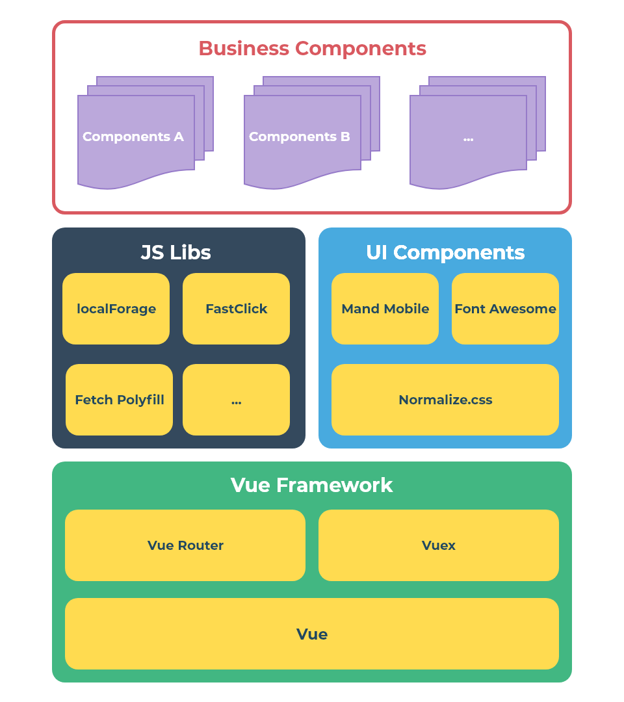
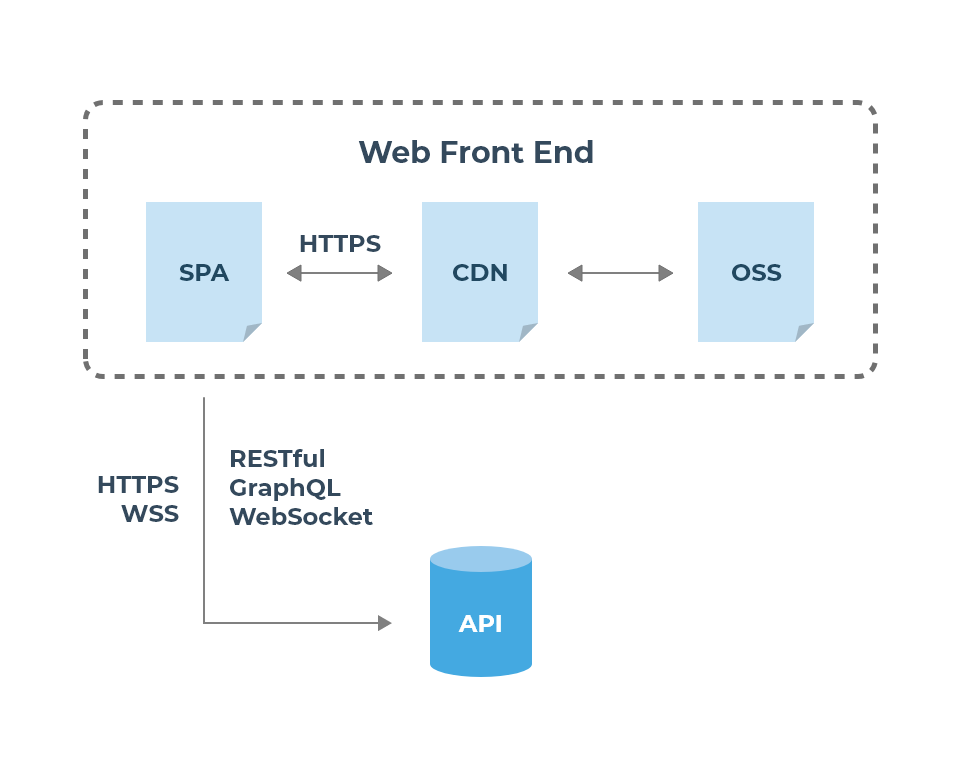
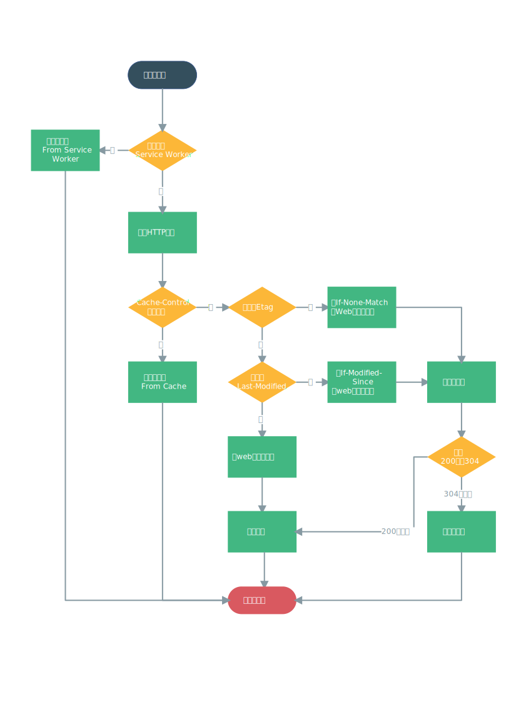

# 代码

## 框架/库



### 框架

框架采用 [Vue](https://vuejs.org/)

主要采用以下特性：

* 单文件组件
* 路由
* 状态管理
* 虚拟 DOM
* 响应式 (Reactive) 和组件化 (Composable) 的视图组件

不使用以下特性：

* TypeScript
* 服务端渲染


### UI组件

UI组件采用 [Mand Mobile](https://didi.github.io/mand-mobile)，Mand Mobile 是滴滴出品的一款适用于金融场景的Vue.js组件，可以满足外修宝，汽修和金融两个场景的需求。

[Font Awesome](https://fontawesome.com/) 是一款流行的图标库，拥有多达一千二百多个免费图标，其中 Automotive 类目下的图标适合外修宝使用。使用 Font Awesome 应该注意，应该按需引入使用的图标，避免文件过大。

[normalize.css](https:necolas.github.io/normalize.css/) 是 Mand Mobile 推荐的 reset 样式，予以采用。

其他UI组件为自定义样式组件或者局部组件，在此不再一一赘述。

### 主要第三方库

[Fast Click](https://github.com/ftlabs/fastclick) 用于解决移动浏览器点击延迟的问题。

[localForage](https://localforage.github.io/localForage/) 用于本地 indexedDB 存储，可以跟 PWA 配合。

[whatwg-fetch](https://github.com/github/fetch) 用于不支持 Fetch API 浏览器的 Fetch Polyfill。

以上三款均是全局第三方库，其他第三方库正在整理

## 数据交互



与服务器的通信交互以HTTP协议为主，同时辅助其他方式。

### RESTful

请求 RESTful API 总是以 HTTP 方式：

```http request
GET /article 列出所有文章
GET /article/${ID} 获取某个指定文章的信息
POST /article 新建文章
PUT /article/${ID} 更新某个指定文章的信息
DELETE /article/${ID} 删除指定文章
```

::: tip
使用 [Fetch API](https://developer.mozilla.org/zh-CN/docs/Web/API/Fetch_API) 构建 HTTP 请求，这是一个新的推荐方式，并且支持PWA。
:::

### GraphQL

GraphQL 是一种新型的查询语言，目标是用于取代 RESTful，可用于一些不重要的功能接口上做尝试。

### WebSocket

对于实时通信应该使用 WebSocket，尽量避免轮询和长轮询。

## PRPL 模式

“PRPL”实际上是 Push/Preload、Render、Precache、Lazy-Load 的缩写，将贯穿于性能优化的全部阶段

### Push/Preload

推送/预加载初始 URL 路由所需的关键资源。

我们希望提前请求一些隐藏在应用依赖关系（Dependency Graph）较深处的资源，以节省 HTTP 往返、浏览器解析文档、或脚本执行的时间。如果我们可以在 webpack 清单、路由等入口代码（entry chunks）被下载与运行之前就把初始 URL，即用户访问的入口 URL 路由所依赖的代码用 Server Push 推送或 `<link rel="preload">` 进行提前加载。那么当这些资源被真正请求时，它们可能已经下载好并存在在缓存中了，这样就加快了初始路由所有依赖的就绪。

::: tip
- 开启 DNS 预读取
- 开启 HTTP/2 Server Push
- 开启 preconnect
- 开启 preload
- 开启 prefetch
:::

### Render

渲染初始路由，尽快让应用可被交互。

既然所有初始路由的依赖都已经就绪，我们就可以尽快开始初始路由的渲染，这有助于提升应用诸如首次渲染时间、可交互时间等指标。多页应用并不使用基于 JavaScript 的路由，而是传统的 HTML 跳转机制，所以对于这一部分，多页应用其实不用额外做什么。

### Precache

用 Service Worker 预缓存剩下的路由。

这一部分就需要 Service Worker 的参与了，Service Worker 是一个位于浏览器与网络之间的客户端代理，它以可拦截、处理、响应流经的 HTTP 请求，使得开发者得以从缓存中向 web 应用提供资源而闻名。不过，Service Worker 其实也可以主动发起 HTTP 请求，在“后台” 预请求与预缓存我们未来所需要的资源。

::: tip
- 启用 PWA
:::

### Lazy-Load

按需懒加载、懒实例化剩下的路由。

懒加载与懒实例化剩下的路由需要实现基于路由的 code splitting 与异步加载。

值得说明的是，无论单页还是多页应用，如果在上一步中，我们已经将这些路由的资源都预先下载与缓存好了，那么懒加载就几乎是瞬时完成的了，这时候我们就只需要付出实例化的代价。

::: tip
- 使用路由懒加载
:::

## 性能

### 网页内容

#### 使用PWA

PWA 在构建时已经默认使用，PWA 将为外修宝带来以下优点：

* **渐进式** - 适用于所有浏览器，因为它是以渐进式增强作为宗旨开发的
* **连接无关性** - 能够借助 Service Worker 在离线或者网络较差的情况下正常访问
* **类似应用** - 由于是在 App Shell 模型基础上开发，因为应具有 Native App 的交互和导航，给用户 Native App 的体验
* **持续更新** - 始终是最新的，无版本和更新问题
* **安全** - 通过 HTTPS 协议提供服务，防止窥探和确保内容不被篡改
* **可索引** - 应用清单文件和 Service Worker 可以让搜索引擎索引到，从而将其识别为『应用』
* **粘性** - 通过推送离线通知等，可以让用户回流
* **可安装** - 用户可以添加常用的 webapp 到桌面，免去去应用商店下载的麻烦
* **可链接** - 通过链接即可分享内容，无需下载安装

::: danger
无论何时都不能关闭PWA。
:::

#### 代码分割

当打包构建应用时，JavaScript 包会变得非常大，影响页面加载。如果我们能把不同路由对应的组件分割成不同的代码块，然后当路由被访问的时候才加载对应组件，这样就更加高效了。

结合 Vue 的异步组件 和 Webpack 的代码分割功能 ，轻松实现路由组件的懒加载。

结合这两者，这就是如何定义一个能够被 Webpack 自动代码分割的异步组件。

```javascript
const Foo = () => import('./Foo.vue');
```

在路由配置中什么都不需要改变，只需要像往常一样使用：

```javascript
const router = new VueRouter({
  routes: [
    { path: '/foo', component: Foo },
  ],
});
```

#### DNS预读取

DNS 预读取是一项使浏览器主动去执行域名解析的功能，其范围包括文档的所有链接，无论是图片的，CSS 的，还是 JavaScript 等其他用户能够点击的 URL。

因为预读取会在后台执行，所以 DNS 很可能在链接对应的东西出现之前就已经解析完毕。这能够减少用户点击链接时的延迟。

DNS 请求需要的带宽非常小，但是延迟却有点高，这点在手机网络上特别明显。预读取 DNS 能让延迟明显减少一些。

```html
<link rel="dns-prefetch" href="//cdn.waixiubao.com">
<link rel="dns-prefetch" href="//api.waixiubao.com">
```

#### 帮助浏览器尽早提供关键资源

`preconnect` 提示浏览器在后台开始连接握手（DNS，TCP，TLS）以提高性能。

`preload` 可以指明哪些资源是在页面加载完成后即刻需要的。对于这种即刻需要的资源，你可能希望在页面加载的生命周期的早期阶段就开始获取，在浏览器的主渲染机制介入前就进行预加载。这一机制使得资源可以更早的得到加载并可用，且更不易阻塞页面的初步渲染，进而提升性能。
 
`prefetch` 链接预取是一种浏览器机制，其利用浏览器空闲时间来下载或预取用户在不久的将来可能访问的文档。网页向浏览器提供一组预取提示，并在浏览器完成当前页面的加载后开始静默地拉取指定的文档并将其存储在缓存中。当用户访问其中一个预取文档时，便可以快速的从浏览器缓存中得到。

```html
<link rel="preconnect" href="//cdn.waixiubao.com/">
<link rel="preconnect" href="//api.waixiubao.com/">
```

::: tip
@vue/cli 为 `preload` 和 `prefetch` 提供默认支持。
:::

#### 启用keep-alive

当你用 `<keep-alive>` 包裹一个组件后，它的状态就会保留，因此就留在了内存里。

`<keep-alive>` 包裹动态组件时，会缓存不活动的组件实例，而不是销毁它们。`<keep-alive>` 是一个抽象组件：它自身不会渲染一个 DOM 元素，也不会出现在父组件链中。

这个技巧可以用来提升用户体验。主要用于保留组件状态或避免重新渲染。

```vue
<template>
  <keep-alive>
    <router-view/>
  </keep-alive>
</template>
```

::: tip
当组件在 `<keep-alive>` 内被切换，它的 `activated` 和 `deactivated` 这两个生命周期钩子函数将会被对应执行。
:::

::: warning
对于一些消耗内存的操作，仍然要注意不活动的组件的内存开销，可以在 `deactivated` 和 `beforeDestroy` 生命周期钩子销毁存在内存泄漏的实例。
:::

### 服务器



#### 使用CDN

对于静态资源，尽量使用 CDN 进行网络加速。CDN 通过部署在不同地区的服务器来提高客户的下载速度。

::: warning
CDN的采购需要一定的成本。
:::

#### 使用HTTP/2

静态资源的加载可以采用 HTTP/2，HTTP/2 将带来如下优势：

* **新的二进制格式（Binary Format）**，HTTP1.x 的解析是基于文本。基于文本协议的格式解析存在天然缺陷，文本的表现形式有多样性，要做到健壮性考虑的场景必然很多，二进制则不同，只认0和1的组合。基于这种考虑 HTTP2.0 的协议解析决定采用二进制格式，实现方便且健壮。
* **多路复用（MultiPlexing）**，即连接共享，即每一个 request 都是是用作连接共享机制的。一个 request 对应一个 id，这样一个连接上可以有多个 request，每个连接的 request 可以随机的混杂在一起，接收方可以根据 request 的 id 将 request 再归属到各自不同的服务端请求里面。
* **header 压缩**，HTTP2.0 使用 encoder 来减少需要传输的 header 大小，通讯双方各自 cache 一份 header fields 表，既避免了重复 header 的传输，又减小了需要传输的大小。
* **服务端推送（server push）**，服务端会将资源文件推送给客户端，当客户端再次尝试获取资源时就可以直接从缓存中获取到，不用再发请求了。

当使用了 HTTP/2 之后，以下优化手段将不再适用：

* 合并精灵图
* 内联代码
* 适用多个域名加速文件下载

```
server {
  listen              443 ssl http2;
  ssl_certificate     server.crt;
  ssl_certificate_key server.key;
  http2_push_preload  on 
}
```

#### 添加 Cache-Control 和 Expires

使用HTTP缓存，有助于提高网络请求性能，需要配置 `Cache-Control` 和 `Expires` 响应头，并设置一个较长的过期时间。

```
# nginx.conf
server {
  expires max;
}
```

::: tip
Cache-Control 的优先级高于 Expires。
:::

#### 配置 ETags

```
# nginx.conf
server {
  etag on;
}
```

#### Gzip 压缩传输文件

Gzip 通常可以减少 70% 网页内容的大小，包括脚本、样式表、图片等文件。Gzip 比 deflate 更高效，主流服务器都有相应的压缩支持模块。

```
# nginx.conf
server {
  gzip on;
  gzip_comp_level 9;
  gzip_types text/plain text/html text/javascript text/css text/xml text/x-component application/javascript application/x-javascript application/xml application/json application/xhtml+xml application/rss+xml application/atom+xml application/x-font-ttf application/vnd.ms-fontobject image/svg+xml image/x-icon font/opentype font/x-woff font/ttf;
  gzip_vary on;
  gzip_static on;
}
```

可以使用 [compression-webpack-plugin](https://github.com/webpack-contrib/compression-webpack-plugin) 进行预压缩，减少服务器CPU的压力

```javascript
// vue.config.js

// $ yarn add compression-webpack-plugin -D
const CompressionPlugin = require('compression-webpack-plugin');

module.exports = {
  configureWebpack: {
    plugins: [
      new CompressionPlugin({
        filename: '[path].gz[query]',
        algorithm: 'gzip',
        test: /\.(js|css)$/,
        cache: true,
        threshold: 10240,
        minRatio: 0.8,
      }),
    ],
  },
};
```

#### Brotli 压缩传输文件

Brotli 可以提供比 gzip 和 deflate 更有效的无损压缩算法。

```
# nginx.conf
server {
  brotli on;
  brotli_comp_level: 11;
  brotli_types text/plain text/html text/javascript text/css text/xml text/x-component application/javascript application/x-javascript application/xml application/json application/xhtml+xml application/rss+xml application/atom+xml application/x-font-ttf application/vnd.ms-fontobject image/svg+xml image/x-icon font/opentype font/x-woff font/ttf;
  brotli_types on;
}
```

::: tip
启用 Brotli 应该先安装 [ngx_brotli](https://github.com/google/ngx_brotli) 模块
:::

### Cookie

#### 减少 Cookie 大小

* 去除没有必要的 cookie，如果网页不需要 cookie 就完全禁掉
* 将 cookie 的大小减到最小
* 注意 cookie 设置的 domain 级别，没有必要情况下不要影响到 sub-domain
* 设置合适的过期时间，比较长的过期时间可以提高响应速度。

### 图片

#### 使用 WebP

优先启用 WebP 格式的图像文件，获取更高的压缩率，从而减少请求时间。

下载 [WebP 插件](https://developers.google.com/speed/webp/)并通过命令行转化图像文件为webp格式。

```bash
cwebp -q 100 image.png -o image.webp
```

在 HTML 中启用 WebP：

```html
<picture>
  <source srcset="image.webp" type="image/webp">
  <source srcset="image.png" type="image/png">
  
</picture>
```

#### 使用 HTML5 视频代替 GIF 动画

用 GIF 作为视频存储格式太可怕了，它们的大小通常非常巨大，导致较慢的页面加载时间和较高的流量。 使用 HTML5 视频，你可以将 GIF 的体积减小高达 98%，同时仍然保留浏览器中 GIF 格式的独特品质。

[ffmpeg](https://ffmpeg.org/) 是一个免费的开源命令行工具，专为处理视频和音频文件而设计。它可用于将 GIF 动画转换为视频格式。

将 GIF 转换为 MP4：

```bash
ffmpeg -i animated.gif video.mp4
```

将 GIF 转换为 WebM：

```bash
ffmpeg -i animated.gif -c vp9 -b:v 0 video.webm
```

将 GIF 转换为 Ogg：

```bash
ffmpeg -i animated.gif -acodec libogg video.ogv
```

在 HTML 中启用视频：

```html
<video>
  <source srcset="video.webm" type="video/webm">
  <source srcset="video.ogv" type="video/ogg; codecs='theora, vorbis'">
  <source srcset="video.mp4" type="video/mp4">
  
</video>
```

#### 处理自适应图形

在图片加载时，可以根据设备加载合适的图片，从而减少请求图片的文件大小。

```html
<picture>
  <source srcset="image.webp 1x, image@2x.webp 2x, image@3x.webp 3x" type="image/webp">
  <source srcset="image.png 1x, image@2x.png 2x, image@3x.png 3x" type="image/png">
  
</picture>


```

```css
.picture {
  background-image: url('image@3x.png');
  background-image: image-set('image.png' 1x, 'image@2x.png' 2x, 'image@3x.png' 3x);
}
```

#### 懒加载屏幕外的图片

轮播动画，滑块或非常长的页面等屏幕外的内容通常会加载图像，即使用户并不能立即在页面上看到它们。

浏览器本身尚不支持懒加载，因此我们使用 JavaScript 来添加此功能。我们使用 [lazysizes](https://www.npmjs.com/package/lazysizes) 添加懒加载行为。

```javascript
import lazysizes from 'lazysizes';
```

```html
<picture>
  <source data-sizes="auto" data-srcset="image.webp 1x, image@2x.webp 2x, image@3x.webp 3x" type="image/webp" class="lazyload">
  <source data-sizes="auto" data-srcset="image.png 1x, image@2x.png 2x, image@3x.png 3x" type="image/png" class="lazyload">
  
</picture>


```

## 安全

### 使用 HTTPS

所有 API 和静态资源的请求，**必须开启 HTTPS**。

::: tip
建议 HTTPS 使用 TLS v1.3 协议。
:::

```
# nginx.conf
server {
  listen                    443 ssl http2;
  ssl_certificate           server.crt;
  ssl_certificate_key       server.key;
  ssl_protocols             TLSv1.3;
  ssl_prefer_server_ciphers on; 
  ssl_dhparam               /etc/nginx/dhparam.pem; # openssl dhparam -out /etc/nginx/dhparam.pem 4096
  ssl_ciphers               ECDHE-RSA-AES256-GCM-SHA512:DHE-RSA-AES256-GCM-SHA512:ECDHE-RSA-AES256-GCM-SHA384:DHE-RSA-AES256-GCM-SHA384:ECDHE-RSA-AES256-SHA384;
  ssl_ecdh_curve            secp384r1;
  ssl_session_timeout       10m;
  ssl_session_cache         shared:SSL:10m;
  ssl_session_tickets       off; 
  ssl_stapling              on; 
  ssl_stapling_verify       on; 
  resolver                  $DNS-IP-1 $DNS-IP-2 valid=300s;
  resolver_timeout          5s; 
  add_header                Strict-Transport-Security "max-age=63072000; includeSubDomains; preload";
}
```

### 启用跨域

在 HTML5 中，一些 HTML 元素提供了对 CORS 的支持， 它允许你配置元素获取数据的 CORS 请求。

```javascript
// vue.config.js
module.exports = {
  crossorigin: 'anonymous'
}
```

生成的 HTML 会在 `<link>` 和 `<script>` 添加 `crossorigin` 属性，浏览器将执行一个远程脚本的脚本而不发送用户凭据。

```html
<script src="https://cdn.waixiubao.com/example.js"
        crossorigin="anonymous"></script>
```
::: tip
如果需要发送用户凭据需要将 `crossorigin` 设置为 `use-credentials`。
:::

### 启用子资源完整性校验

子资源完整性(SRI)是允许浏览器检查其获得的资源（例如从 CDN 获得的）是否被篡改的一项安全特性。它通过验证获取文件的哈希值是否和你提供的哈希值一样来判断资源是否被篡改。

通过以下配置，启用子资源完整性：

```javascript
// vue.config.js
module.exports = {
  integrity: true
}
```

服务器在 CSP 头部添加 require-sri-for 指令进行验证：

```
# nginx.conf
server {
  add_header Content-Security-Policy "require-sri-for script style";
}
```

启用子资源完整性验证，生成的 HTML 会在 `<link>` 和 `<script>` 添加 `integrity` 属性。

```html
<script src="https://cdn.waixiubao.com/example.js"
        integrity="sha384-oqVuAfXRKap7fdgcCY5uykM6+R9GqQ8K/uxy9rx7HNQlGYl1kPzQho1wx4JwY8wC"
        crossorigin="anonymous"></script>
```

::: warning
当启用 SRI 时，preload resource hints 会被禁用，因为 [Chrome 的一个 bug](https://bugs.chromium.org/p/chromium/issues/detail?id=677022) 会导致文件被下载两次。
:::

### XSS

#### v-html

慎用 `v-html` ，动态渲染的任意 HTML 可能会非常危险，因为它很容易导致 XSS 攻击。请只对可信内容使用 HTML 插值，**绝不要**对用户提供的内容使用插值。

::: danger
动态渲染的任意 HTML 可能会非常危险，因为它很容易导致 XSS 攻击。请只对可信内容使用 HTML 插值，**绝不要**对用户提供的内容使用插值。
:::

#### CSP

参见 [CSP](#内容安全策略-csp)

#### X-Frame-Options

X-Frame-Options HTTP 响应头是用来给浏览器指示允许一个页面可否在 `<frame>`, `<iframe>` 或者 `<object>` 中展现的标记。网站可以使用此功能，来确保自己网站的内容没有被嵌到别人的网站中去，也从而避免了点击劫持 (clickjacking) 的攻击。

X-Frame-Options 有三个值:

**`DENY`**

表示该页面不允许在 `frame` 中展示，即便是在相同域名的页面中嵌套也不允许。

**`SAMEORIGIN`**

表示该页面可以在相同域名页面的 `frame` 中展示。

**`ALLOW-FROM uri`**

表示该页面可以在指定来源的 `frame` 中展示。 

```
# nginx.conf
server {
  add_header X-Frame-Options DENY;
}
```

#### X-Download-Options:noopen

禁用下载框 Open 按钮，防止下载文件默认被打开 XSS。

```
# nginx.conf
server {
  add_header X-Download-Options noopen;
}
```

#### X-Content-Type-Options:nosniff

禁用浏览器自动嗅探 MIME 功能例如 `text/plain` 却当成 `text/html` 渲染，特别当本站点 serve 的内容未必可信的时候。

```
# nginx.conf
server {
  add_header X-Content-Type-Options nosniff;
}
```

#### X-XSS-Protection

浏览器提供的一些 XSS 检测与防范。

```
# nginx.conf
server {
  add_header X-XSS-Protection "1; mode=block";
}
```

### 内容安全策略 CSP

内容安全策略 (CSP)  是一个附加的安全层，用于帮助检测和缓解某些类型的攻击，包括跨站脚本 (XSS) 和数据注入等攻击。 这些攻击可用于实现从数据窃取到网站破坏或作为恶意软件分发版本等用途。

CSP 的主要目标是减少和报告 XSS 攻击。XSS 攻击利用浏览器对从服务器接受的内容的信任。恶意的脚本在受害的浏览器被执行, 因为浏览器相信内容源，甚至当内容源并不是从它应该来的地方过来的。

CSP 使服务器管理员能够通过制定浏览器能够执行的可信赖脚本的域名来减少或者消除由 XSS 可能出现的矢量。 一个兼容 CSP 的浏览器将只会执行加载与白名单域名的源文件的脚本，忽略那些其他的脚本（包括内联脚本和事件操控 HTML 属性）。

作为一种最终的保护，想要禁止脚本的站点可以选择全局禁止脚本执行。

为了重新约束内容被下载的域名, 服务端能够制定那种协议能够被使用；例如（理论上，从安全的立足点来看），一个服务制定所有的内容都通过 HTTPS 协议来加载。从而减少数据包监听攻击。

使用 CSP 需要使用 `Content-Security-Policy`，同时，现代浏览器使用一段内联脚本来避免 Safari 10 重复加载脚本包，所以如果你在使用一套严格的 CSP，你需要这样显性地允许内联脚本，此外，子资源完整性(SRI)校验也是通过 CSP 配置完成的，所以完整的CSP请求头如下：

```
Content-Security-Policy: script-src 'self' 'https://cdn.waixiubao.com' 'sha256-4RS22DYeB7U14dra4KcQYxmwt5HkOInieXK1NUMBmQI=';require-sri-for script style;
```

```
# nginx.conf
server {
  add_header Content-Security-Policy "script-src 'self' 'https://cdn.waixiubao.com' 'sha256-4RS22DYeB7U14dra4KcQYxmwt5HkOInieXK1NUMBmQI=';require-sri-for script style";
}
```

## 兼容性

兼容性采用**优雅降级**方案：一开始就构建站点的完整功能，然后针对浏览器进行降级处理。

### 兼容级别

| 浏览器 | 级别 |
|-------|------|
| Google Chorme | B |
| Chrome for Android | A |
| Safari | B |
| iOS Safari | A |
| Firefox | B |
| Edge | C |
| Internet Explorer | D |
| UC Browser for Android | B |
| QQ Browser | A |
| X5 TBS | A |

* A：提供完全支持
* B：提供完全支持，但不进行兼容性测试
* C：提供有限支持
* D：不支持

### browserslist配置

浏览器只兼容最近 2 个版本和市场占有率大于 1% 的版本，不支持IE，不支持停止支持的浏览器。

```json
{
  "browserslist": [
    "last 2 version",
    "> 1%",
    "not ie <= 11",
    "not ie_mob <= 11",
    "not op_mini all",
    "not dead"
  ]
}
```
