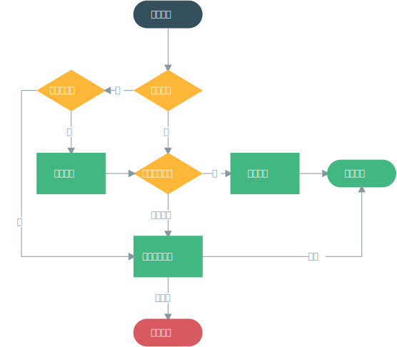
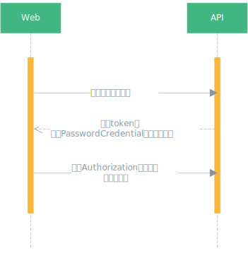
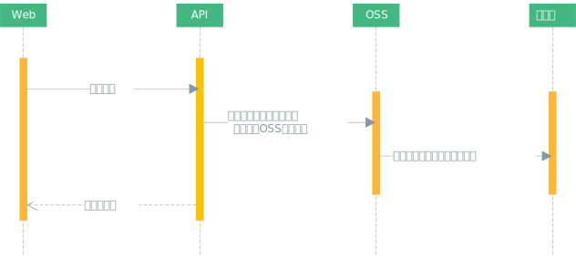

# 功能设计

## 数据容灾兜底

## 登录鉴权

### 账号登录

### 第三方登录

## 支付

### 微信支付

### 支付宝支付

### Apple Pay/银联支付

## 文件上传

## 错误监控

错误监控采用 [Sentry](https://docs.sentry.io/platforms/javascript/vue/)，可参考安装代码。

## 用户行为统计

用户行为统计[友盟+](https://web.umeng.com/main.php?spm=a211g2.182260.0.0.6eeb9761FrLzzK&c=user&a=index)，可参考安装代码。
